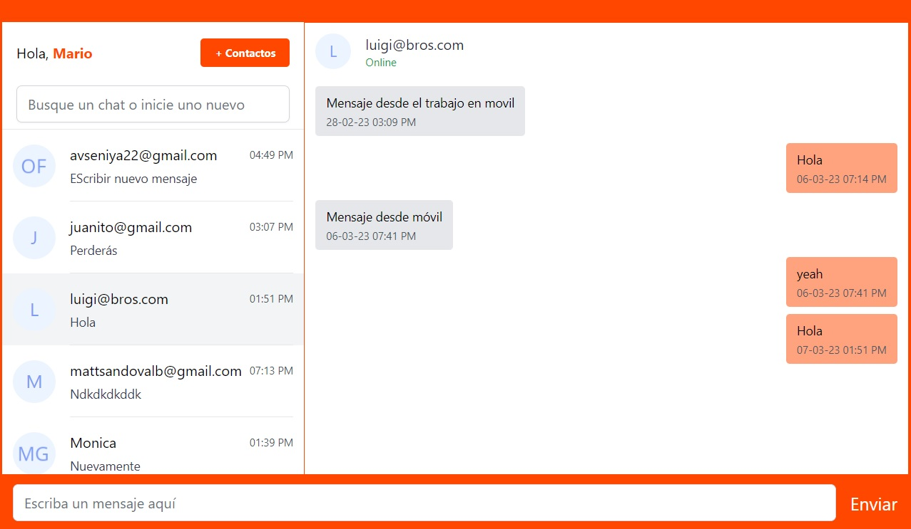
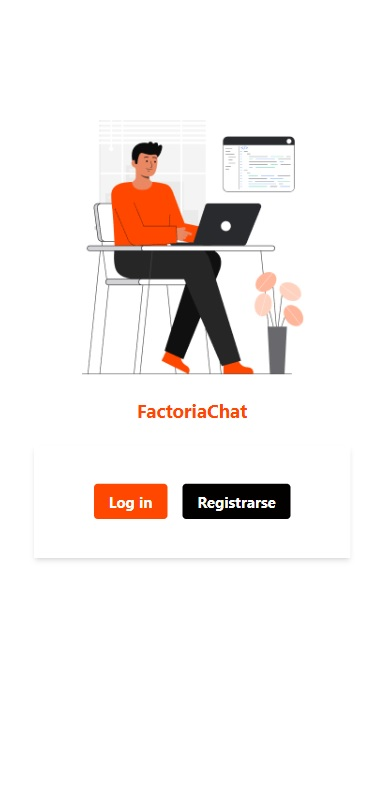
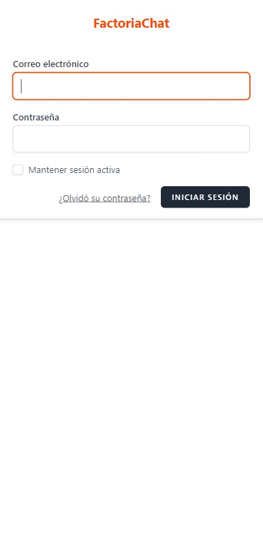
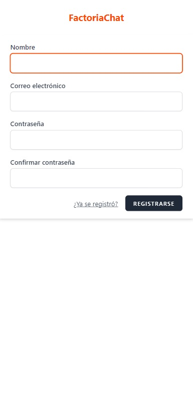
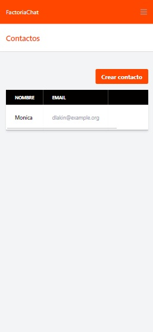
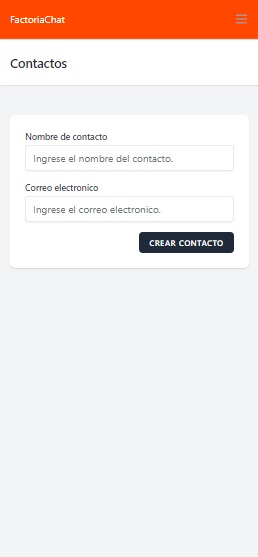
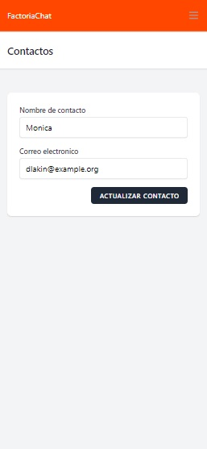
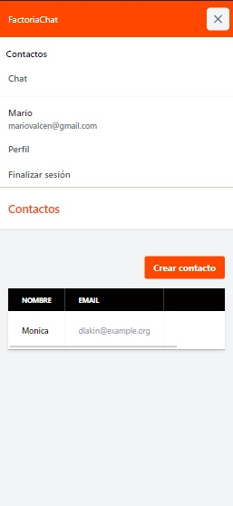
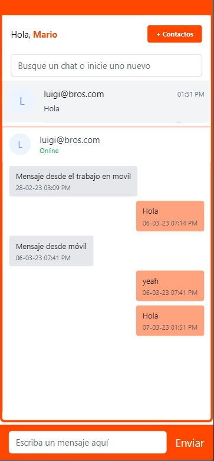

<p align="center"></p>

## Table of contents
* [General Information](#general-information)
* [Team Members](#team-members)
* [Screenshots](#screenshots)
* [Technologies](#technologies)
* [Installation](#how-to-install-this-project)
* [Deployment](#deployment)
* [Tools](#tools)


***
## General Information

## <div align="center"> This chat seeks to establish a bridge between users and teachers to facilitate communication with the "Factory Academy" platform.. </div>

Our project aims to allow applicants to have their first contact with the code. It makes it easier for teachers and administrators to take control over the learning process of users.

***

## Team Members

| Name | Role | Github |
| :---: | :---: | :---: |
| Judit Calvet |  Scrum Master | https://github.com/Judit-Calvet |
| Matt Sandoval | Product Owner| https://github.com/mattsandovalb |
| Oksana Fedyukova | Developer | https://github.com/OksanaFedyukova |
| Eduard Torres | Developer | https://github.com/Elfin2 |
| Mario Centurión | Developer | https://github.com/Mariovalcen |

***

## Screenshots

<table>
<tr>
<td></td>
<td></td>
<td></td>
<td></td>
</tr>
<tr>
<td></td>
<td></td>
<td></td>
<td></td>
</tr>
</table>


***

## Technologies

The project was developed with the following technologies

- Laravel Framework
- Laravel Livewire
- Laravel Jetstream
- Pusher
- Laravel-websockets
- MySQL
- Tailwind

***
### For the chat

- This chat has served to be implemented in the FactoriAcademy project. The project can be found in the repository: https://github.com/mattsandovalb/FactoriAcademy-client.git

***

## How to install this project

You will need a text editor and perform the following steps:

1. Clone the project, frontend and backend
```bash
  https://github.com/Mariovalcen/Chat-Factoria.git
```

2. Go to the project directory
```bash
  cd factoriachat
  checkout style-deploy
```

3. Start MySQL service and create a MySQL database named "jetstream"

4. Create in the text editor an .env file by copying the contents of .env.example and modify the database name to
"jetstream"

5. Install dependencies
```bash
  npm install
```
```bash
  composer install
```

6. Activate the server and keep this terminal open
```bash
  npm run dev
```

7. Run the PHP server and keep this terminal open
```bash
  php artisan serve
```

8. Migrate database
```bash
  php artisan migrate:fresh --seed
```

9. Enable websockets
```bash
  php artisan websockets:serve
```
10. Enable Queue
```bash
  php artisan queue:work
```

***
## Deployment

[Visit our link](https://factoriachat.es/)
***
## Tools

- GitHub
- Digital Ocean
- Laravel Forge
***